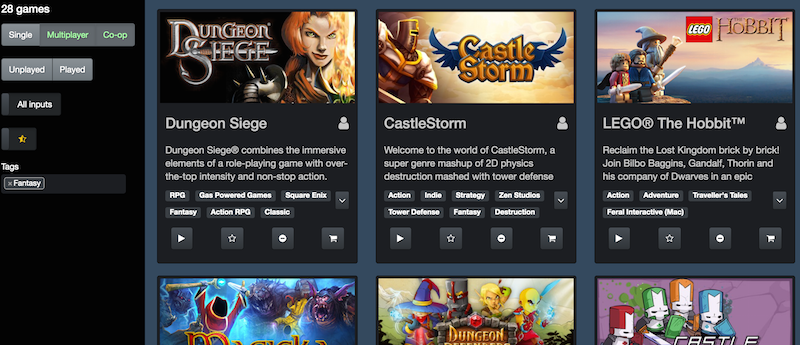

# Steam library browser

Browse and filter Steam games.  Display logo, description, and tags. Hide or star games.



Filter by

- players (from players and tags)
- played (from playtime_forever)
- controller support (from features and tags)
- starred
- tags (from tags and genres)

Get list of games from [GetOwnedGames](https://developer.valvesoftware.com/wiki/Steam_Web_API#GetOwnedGames_.28v0001.29) in the Steam Web API. [Scrape Steam store pages](https://github.com/kielni/megapis/tree/master/workers/steam_library) for game metadata, and save as JSON:

````
{
    "data": [
        {
            "appid": 26000,
            "name": "The Maw",
            "img_icon_url": "b76fd1a5f674825f0fa6a0e7b8be077347dbed16",
            "img_logo_url": "1209ecfa85ad86fe92e67cdf885764032d85893c",
            "url": "http://store.steampowered.com/app/26000/",
            "title": "The Maw",
            "players": "Single-player",
            "genres": ["Action", "Indie", "Twisted Pixel Games"],
            "description": "The pinnacle of alien evolution, Maw is a cowardly fat blob concerned mostly with snacking and lounging. He can, however, absorb the traits of anything he eats, is virtually indestructible, and can grow to unlimited size. If he wasn't a danger to all life in the universe, he'd make the perfect pet. In this action/adventure game, he's the best friend of our hero Frank, and only by working together can Maw eat their way to freedom. The Maw was honored with the Audience Choice Award in the 2008 PAX-10 showcase of independent games, and is a finalist at this year's Independent Games Festival for Technical Excellence. Unlock all the Steam Achievements! Full featured 3D action/adventure Winner of the 2008 PAX 10 Audience Choice Award Finalist in the 2009 Independent Games Festival Unstoppable and insatiably hungry Maw that grows to limitless proportions Cinemas with lots of personality and humor throughout the entire buddy-comedy storyline Versatile leash for manipulating creatures and objects Eight levels with varying puzzles and traps to overcome Five unique creatures that instill Maw with five unique powers Interactive soundtrack by award-winning composer Winifred Phillips Additional levels available as downloadable content",
            "tags": ["Indie", "Platformer", "Cute", "Action", "Puzzle", "Casual", "3D Platformer"],
            "features": ["Single-player", "Steam Achievements"]
        },
    ]
}
````
